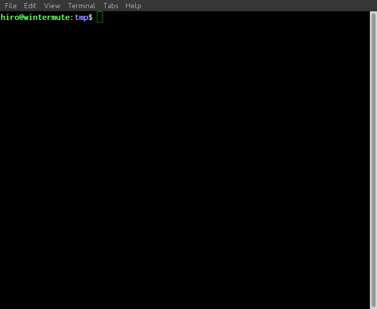

repl
====

Runs a command in a `REPL <https://en.wikipedia.org/wiki/Read-eval-
print_loop>`_. It comes in very handy when dealing with applications that do
not ship with a REPL, but could benefit greatly from one (such as git_).

Tab completion is available and completes filenames.

Real productivity
-----------------

Set an alias in your shell's start-up file:

    alias rg="repl git"

Instead of typing ``git ...``, type ``rg`` once. You'll never go back.

Installation
------------

``repl`` must be installed from PyPI_

.. _git: https://git-scm.com
.. _PyPI: http://pypi.python.org.

Detailed usage
--------------

Running ``repl COMMAND ARG1 ARG2...`` will start the loop. Any line entered
will now be appended to ``COMMAND ARG1 ARG2...`` and executed. The result is
displayed and ``repl`` will wait for the next line to be entered.

Try ``repl --help`` for a list of options.

Exiting
~~~~~~~

To quit the REPL, send an ``EOF`` symbol (usually done with ``Ctrl-d`` on *nix
systems, ``Ctrl-z`` on Windows).

Command substitution
~~~~~~~~~~~~~~~~~~~~

If you run into a command that needs arguments passed somewhere in between
other arguments by passing ``{}`` as the argument. It will be replaced with
``…`` in the prompt.

.. code-block:: sh

    $ repl echo Hello, {} - Nice to meet you!
    echo Hello, … - Nice to meet you!>> Alice
    Hello, Alice - Nice to meet you!
    echo Hello, … - Nice to meet you!>> Bob
    Hello, Bob - Nice to meet you!
    echo Hello, … - Nice to meet you!>>

Credits
-------

Idea stolen from https://github.com/defunkt/repl, which unfortunately is
unmaintained. Originally rewritten because I had issues with stdin/stdout; now
it boasts a few extra features (and does not require ruby)
